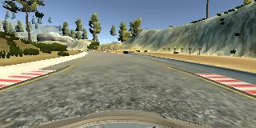
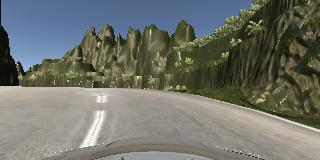
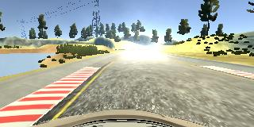
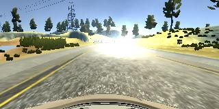
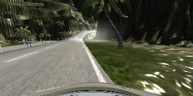

** Behavioral Cloning Project

The goals / steps of this project are the following:
+  Use the simulator provided by udacity as a part of the Self-Driving Program  to collect data of good driving behavior

+ Build, a convolution neural network in Keras that predicts steering angles from images

+ Train and validate the model with a training and validation set

+ Test that the model successfully drives around track one without leaving the road

+ Summarize the results with a written report


---

My project includes the following files:
+ model.py containing the script to create and train the model

+ drive.py for driving the car in autonomous mode

+ model.h5 containing a trained convolution neural network 

+ README.md

+ examples - contains examples images from dataset 


####2. Submission includes functional code
Using the Udacity provided simulator and my drive.py file, the car can be driven autonomously around the track by executing 
```sh
python drive.py model.h5
```

####3. Submission code is usable and readable

The model.py file contains the code for training and saving the convolution neural network. The file shows the pipeline I used for training and validating the model, and it contains comments to explain how the code works.


###Model Architecture and Training Strategy

####1. An appropriate model architecture has been employed

I did my  initial experimentation with the architecture from the Keras chapter(one convolution layer;  small traffic signs dataset). Since the initial model did not perform well despite me augmenting the dataset,  I tried the LeNet model described in the Behavioral Network (Even More Powerful Network). And it proved to be successful in learning to drive Track 1.

####2. Attempts to reduce overfitting in the model

The model was trained and validated on different data sets to ensure that the model was not overfitting (code line 63). The model was tested by running it through the simulator and ensuring that the vehicle could stay on the track.

Data from both tracks were generated using the simulation to prevent overfitting into one track.
The dataset was split into two - 80% used for training and 20% used for validation.

####3. Model parameter tuning
Epochs: I tried 10 iterations for my first run and realized there wasn't too much learning happening after the first three epochs and decided to stop at 3. This still took about 30-35 minutes on my laptop.

The model used an adam optimizer, so the learning rate was not tuned manually (model.py line 109).

####4. Appropriate training data

Training data was chosen to keep the vehicle driving on the road. I used a combination of center lane driving, recovering from the left and right sides of the road ... 

For details about how I created the training data, see the next section. 

###Model Architecture and Training Strategy

####1. Solution Design Approach

I did my  initial experimentation with the architecture from the Keras chapter(one convolution layer;  small traffic signs dataset). Since the initial model did not perform well despite me augmenting the dataset,  I tried the LeNet model described in the Behavioral Cloning chapter (Even More Powerful Network). And it proved to be successful in learning to drive Track 1.

In order to gauge how well the model was working, I split my image and steering angle data into a training(80%) and validation(20%) set. I found that my first model had a low mean squared error on the training set and a similar  mean squared error on the validation set. So, I thought it was a good model. I ran it on the simulator to see how well the car was driving around track one. Track one has a bias towards left turns, at least in the beginning. Though I had added training data by driving reverse on track 1, I found that the vehicle was slowly but constantly veering towards the right side of the track. And eventually fell into the river. On closer inspection, I realized that the car was always generating the same output irrespective of the situation!! Clearly there had been some kind of over-fitting. My hunch is that it  was caused by either an incomplete dataset(track 1 only) and/or a smaller network.

To overcome this, I added more training data as described below and decided to try the LeNet architecture. This worked surprisingly well and the car was able to drive on track 1.
However on track 2, the car drove well initially but wasn't able to make it past one of the shar p turns and drove off the road and had a big fall from high altitude. It wasn't pretty.

So to improve upon this, I added more training data. I added some training data for driving backwards on track 2 and also examples where the car recovered from bad positions.

I tried the same network structure again, but I wanted to try out transfer learning to seed the new network with old weights.
So, I used the weights from the previous network (Line 156: model.load_weights(old_model_name+"_weights.h5")) and then ran the training algorithm.

####2. Final Model Architecture

I used the LeNet model described in the Behavioral Cloning chapter (Even More Powerful Network).And I had success using it in the Traffic Signs project. So, it felt like a good starting point.

The final model architecture (model.py lines 67-110) consisted of a convolution neural network with the following layers and layer sizes ...

Layer 1: Preprocessing - Normalized to -1 to 1 range by dividing image intensities by 128. 
Neural networks better with outputs in this range.

Layer 2: Cropping irrelevant scenery (top 70 px) and the car(bottom 25 px) from the image

Layer 3a: Convolutional. 5x5 filter Stride=1 Depth=6
3b: RELU Activation.
3c: Max Pooling with pool-size 2 x 2 and valid padding
    model.add(MaxPooling2D(pool_size=(2, 2),border_mode="valid"))

Layer 4a: Convolutional. 5x5 filter Stride=1 Depth=16
    model.add(Convolution2D(nb_filter=16, nb_row=5,nb_col=5, subsample=(1,1),bias=True))
Layer 4b: RELU Activation.
Layer 4c: Max Pooling with pool-size 2 x 2 and valid padding
    model.add(MaxPooling2D(pool_size=(2, 2),border_mode="valid"))

Layer 5: Flatten. 

Layer 6a: Fully Connected Network 120 Outputs
Layer 6b: RELU Activation.

Layer 7a: Fully Connected. Input = 120. Output = 84.
Layer 7b: RELU Activation.

Layer 8: Fully Connected. Input = 84. Output = 1.


####3. Creation of the Training Set & Training Process
Here is an example of a Normal Training Image from Track 1 where the car is almost straight :



Here is an example of a Normal Training Image from Track 2 where the car is almost straight:



Here is an example of a Training Image from Track 1 where the car is in a bad position:



Here is an example of a Training Image from Track 1 where the car has recovered from a bad position:



Here is an example of a Training Image from Track 2 where the car is in a bad position:



I ended up using 6 different simulations combined with 2 augmentation strategies:

1. Track 1 center lane driving
2. Track 1 reverse direction driving
3. Track 1 recovery driving (recovering from both left and right)
4. Track 2 (provides harder turns)

Augmentation 1: Use Left, Right images in addition to Center. Used the tip mentioned in the video lesson to adjust target steering by +/- 0.2.

Augmentation 2: Lateral Flip

Final two simulations added for my second and final model:
5. Track 2 Reverse direction driving
6. Track 2 recovery driving

Summary:
In this project, I learned how to use behavior cloning techniques to learn how to drive on two tracks.

+ LeNet Model with Cropping and Preprocessing and four datasets
+ Training data included simulations from both tracks
+ Augmentations include Lateral flip and using left right images
+ Used Transfer Learning(fine-tuning) to learn my second and final model on the full dataset.

The fact that the LeNet architecture solves the problem and I didn't have to try more complicated solutions (like the  NVIDIA example) indicates to me that having really good training data is important for Behavior Cloning. Perhaps even more important than the network architecture. 

ps: The car occasionally gets stuck on track 2. Meaning it doesn't move. Hhowever it's not the steering; it's usually in the center of the track and the throttle doesn't work. I don't know the reason why. 
